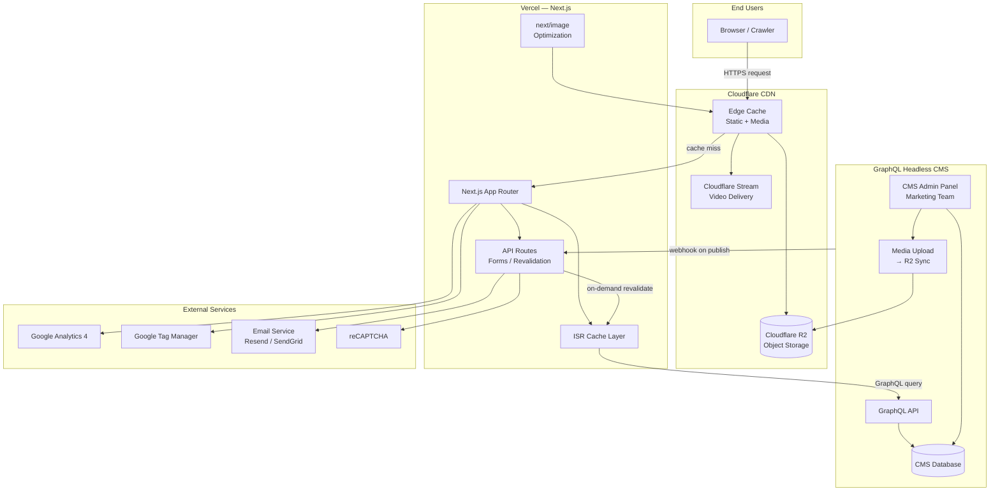
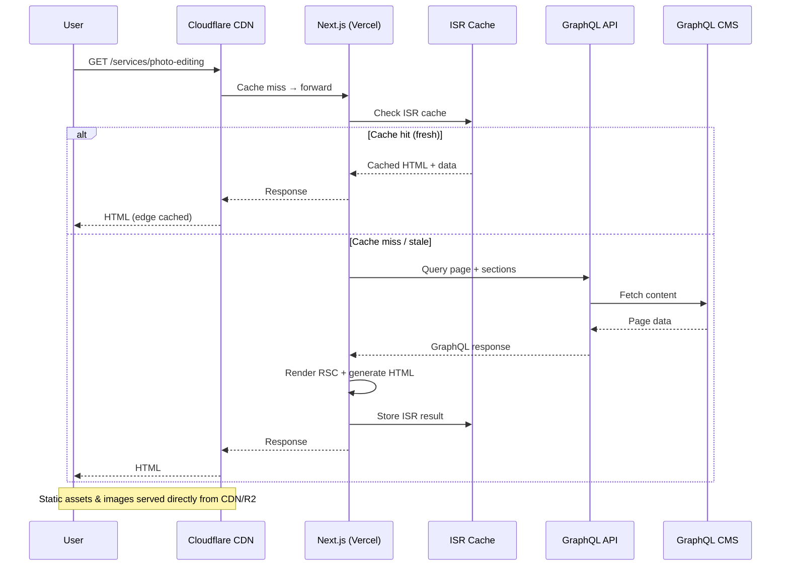
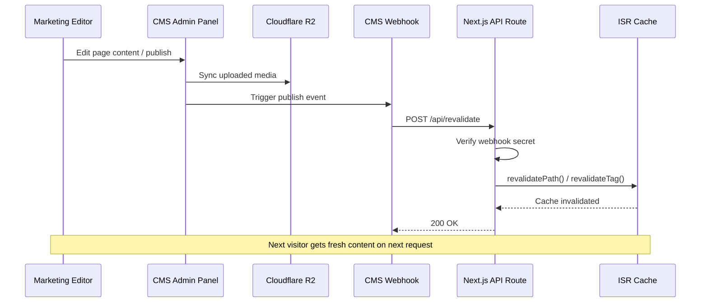
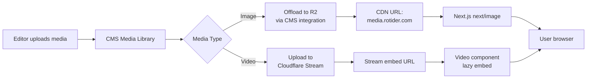
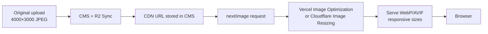
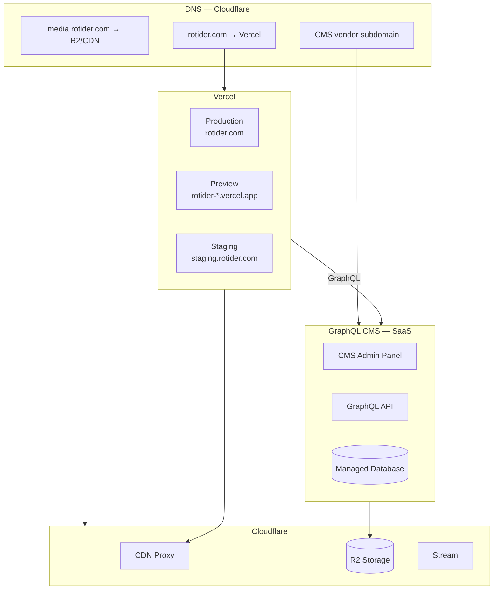
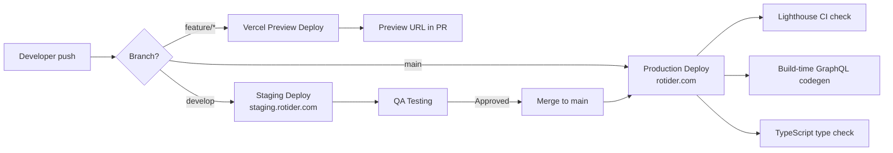
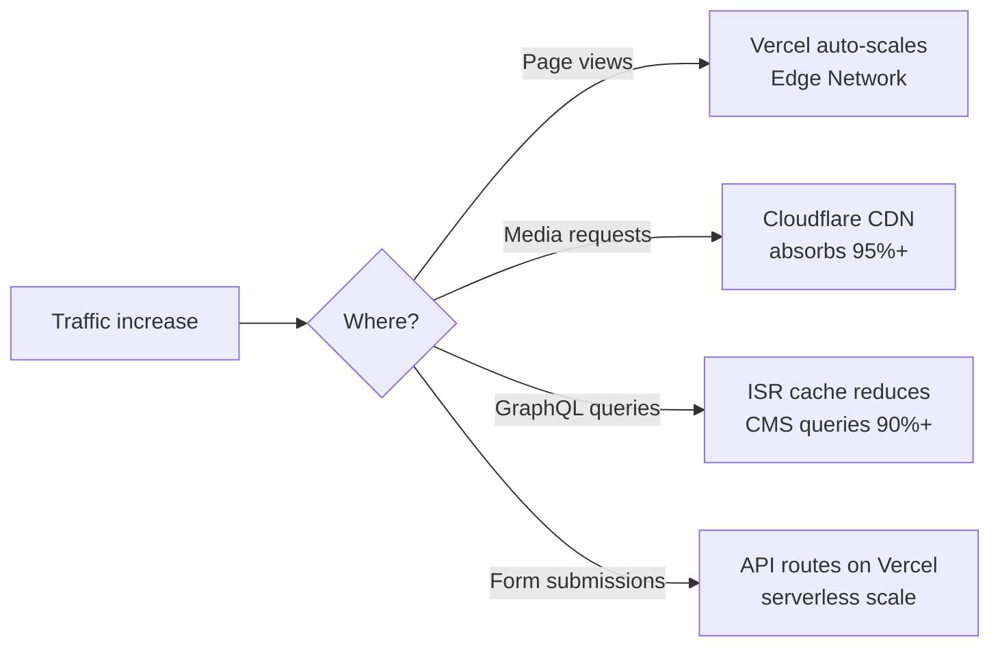

# Rotider Landing Page — Architecture Document

| | |
|---|---|
| **Version** | 1.1 |
| **Date** | 13/06/2026 |
| **Status** | Draft — For Engineering Review |
| **Scope** | Landing Page rebuild (Next.js) |
| **Out of Scope** | Legacy order/account system migration |

**Related documents:**
- [FEATURES.md](./FEATURES.md) — Business feature specification
- [Báo giá] Rotider Website.pdf — Design scope & page structure

---

## Table of Contents

1. [Overview](#1-overview)
2. [High Level Architecture](#2-high-level-architecture)
3. [Frontend Architecture (Next.js)](#3-frontend-architecture-nextjs)
4. [CMS Architecture](#4-cms-architecture)
5. [GraphQL Design](#5-graphql-design)
6. [SEO Architecture](#6-seo-architecture)
7. [Media & CDN Strategy](#7-media--cdn-strategy)
8. [Deployment Architecture](#8-deployment-architecture)
9. [Security Considerations](#9-security-considerations)
10. [Performance Strategy](#10-performance-strategy)
11. [Scalability](#11-scalability)
12. [Cost Estimation](#12-cost-estimation)
13. [Recommended Tech Stack](#13-recommended-tech-stack)
14. [Risks & Tradeoffs](#14-risks--tradeoffs)
15. [Final Recommendation](#15-final-recommendation)

---

## 1. Overview

### 1.1 Project Goals

Rotider đang rebuild **landing page marketing** — website giới thiệu dịch vụ chỉnh sửa ảnh, video và property visualization cho thị trường bất động sản. Mục tiêu chính:

| Goal | Description |
|---|---|
| **Modern frontend** | Thay thế WordPress theme truyền thống bằng Next.js App Router |
| **Content autonomy** | Marketing team tự quản lý nội dung qua headless CMS, không cần developer |
| **Lead generation** | Tối ưu conversion qua Contact form, CTA, Pricing |
| **Brand trust** | Portfolio, testimonials, case studies, About |
| **Content marketing** | Blog với SEO tốt để thu hút organic traffic |

### 1.2 Scope — Landing Page

**In scope:**

| Area | Pages / Features |
|---|---|
| **Marketing pages** | Homepage, Photo-editing, Video-editing, Property Visualization, Portfolio, About, Pricing, Contact, Career |
| **Blog** | Blog list, Blog post detail |
| **Global components** | Header, Footer, CTA blocks, FAQ, Testimonials, Before/After slider |
| **Forms** | Contact form, Career apply (email-based) |
| **CMS** | GraphQL Headless CMS — toàn bộ content quản lý trên CMS Admin Panel |
| **SEO & Performance** | SSR/SSG/ISR, sitemap, structured data, Core Web Vitals |
| **Media** | CDN-backed image/video delivery, before/after galleries |
| **Responsive** | 7 breakpoints (1760px → 390px) |

**Out of scope:**

| Area | Reason |
|---|---|
| **Legacy order system** | Hệ thống đặt hàng cũ không migrate |
| **User account / dashboard** | Khách hàng upload ảnh qua portal riêng (existing system) |
| **Payment processing** | Pricing page là thông tin, không thanh toán online |
| **CRM integration** | Phase 2 — có thể tích hợp HubSpot sau |
| **Multi-language (i18n)** | Phase 2 — architecture sẵn sàng mở rộng |
| **Live chat / chatbot** | Không nằm trong design scope |

### 1.3 Problems with Legacy System

Hệ thống landing page WordPress theme hiện tại (monolithic) gặp các vấn đề:

| Problem | Impact |
|---|---|
| **Tight coupling theme + content** | Mỗi thay đổi UI cần chỉnh theme PHP, rủi ro break layout |
| **Poor performance** | Plugin bloat, render-blocking JS/CSS, không tối ưu image pipeline |
| **Limited SEO control** | Meta tags phụ thuộc plugin (Yoast/RankMath), inconsistent structured data |
| **Monolithic architecture** | CMS, rendering, media serving cùng một server → bottleneck khi traffic tăng |
| **Developer dependency** | Marketing không thể tự cập nhật section/block mà không qua dev |
| **Shared infra with order system** | Landing page traffic ảnh hưởng performance hệ thống order (và ngược lại) |
| **No preview workflow** | Khó preview nội dung trước khi publish cho stakeholder |

### 1.4 Technical Goals

#### SEO

- Server-rendered HTML với metadata đầy đủ cho mọi page
- Automated sitemap.xml và robots.txt
- Structured data (Organization, Service, Article, FAQ, BreadcrumbList)
- Canonical URLs, OpenGraph, Twitter Cards
- Clean URL structure (`/services/photo-editing`, `/blog/[slug]`)
- 301 redirect map từ URLs cũ sang URLs mới

#### Performance

- Lighthouse Performance score ≥ 90 (mobile)
- LCP < 2.5s, INP < 200ms, CLS < 0.1
- ISR cho content pages, SSG cho static pages
- `next/image` + CDN cho toàn bộ media
- Bundle size tối ưu qua Server Components và code splitting

#### Scalability

- Frontend scale horizontally trên Vercel Edge Network
- GraphQL CMS (SaaS/managed) tách biệt, không chia sẻ với order system
- CDN absorb media traffic, giảm load origin
- GraphQL query caching giảm CMS load

#### Maintainability

- TypeScript strict mode across frontend
- Component-driven architecture, design system tokens
- Typed GraphQL queries (codegen)
- Clear separation: presentation (Next.js) vs content (GraphQL CMS)
- Preview deployments per PR

#### CMS Flexibility

- Page builder pattern: flexible content blocks/sections
- Marketing team edit content without deploy
- On-demand revalidation khi publish/update
- Media library với CDN offload
- Draft → Preview → Publish workflow

---

## 2. High Level Architecture

### 2.1 System Overview

Hệ thống theo mô hình **Jamstack + GraphQL Headless CMS**:

- **Next.js** (Vercel): rendering layer, SEO, forms, API routes
- **GraphQL CMS** (SaaS): content management + admin panel — toàn bộ nội dung quản lý tại đây
- **GraphQL API**: native API bridge giữa CMS và frontend
- **Cloudflare CDN**: cache static assets, media, edge optimization
- **Cloudflare R2**: object storage cho media files (sync từ CMS)
- **Vercel Edge**: ISR cache, geo-routing

### 2.2 Architecture Diagram



### 2.3 Request Flow



**Request flow summary:**

1. User request tới `rotider.com` → DNS resolve qua Cloudflare
2. Cloudflare serve cached static/media nếu có
3. Dynamic page request forward tới Vercel (Next.js)
4. Next.js check ISR cache → hit: return immediately; miss: fetch GraphQL
5. GraphQL API query CMS database, return typed JSON
6. Next.js render Server Components → HTML response
7. Response cached tại ISR layer + Cloudflare edge

### 2.4 Content Management Flow



### 2.5 Media Delivery Flow



---

## 3. Frontend Architecture (Next.js)

### 3.1 Why Next.js

| Reason | Benefit for Rotider |
|---|---|
| **App Router + RSC** | Server-rendered HTML cho SEO; minimal client JS |
| **ISR** | Content pages cached, revalidate on CMS publish — balance freshness & speed |
| **Built-in metadata API** | Type-safe SEO metadata per page |
| **Image Optimization** | Automatic WebP/AVIF, responsive sizes — critical for before/after galleries |
| **Vercel integration** | Zero-config deploy, preview URLs, edge caching |
| **API Routes** | Form handling, webhook revalidation without separate backend |
| **Mature ecosystem** | TypeScript, GraphQL codegen, testing tools |

### 3.2 App Router Architecture

```
app/
├── layout.tsx                  # Root layout: fonts, GTM, global providers
├── page.tsx                    # Homepage
├── not-found.tsx
├── error.tsx
├── sitemap.ts                  # Dynamic sitemap generation
├── robots.ts                   # robots.txt
│
├── (marketing)/                # Route group — shared marketing layout
│   ├── layout.tsx              # Header + Footer wrapper
│   ├── services/
│   │   ├── photo-editing/page.tsx
│   │   ├── video-editing/page.tsx
│   │   └── property-visualization/page.tsx
│   ├── portfolio/page.tsx
│   ├── about/page.tsx
│   ├── pricing/page.tsx
│   ├── contact/page.tsx
│   └── career/page.tsx
│
├── blog/
│   ├── page.tsx                # Blog list
│   └── [slug]/page.tsx         # Blog detail
│
├── api/
│   ├── contact/route.ts        # Contact form handler
│   ├── revalidate/route.ts     # CMS webhook → ISR invalidation
│   └── preview/route.ts        # Draft preview mode
│
└── preview/
    └── [...slug]/page.tsx      # Preview unpublished content
```

### 3.3 Rendering Strategy — SSR vs SSG vs ISR

| Page | Strategy | Revalidate | Rationale |
|---|---|---|---|
| Homepage | **ISR** | 3600s (1h) | Content thay đổi thường xuyên (testimonials, CTA); on-demand revalidate khi publish |
| Service pages | **ISR** | 3600s | Section content managed via CMS; stable structure |
| Portfolio | **ISR** | 1800s (30min) | Gallery updates moderately |
| About | **ISR** | 86400s (24h) | Rarely changes |
| Pricing | **ISR** | 3600s | Price updates need reasonable freshness |
| Contact | **SSG** | — | Mostly static layout; form is client-side |
| Career | **ISR** | 1800s | Job postings change periodically |
| Blog list | **ISR** | 600s (10min) | New posts added regularly |
| Blog detail | **ISR** | 3600s | Per-slug cache; revalidate on publish |
| 404 / Error | **SSG** | — | Static fallback pages |

**On-demand revalidation** triggered by CMS webhook overrides time-based revalidate — editor publish → instant cache bust.

```typescript
// app/services/photo-editing/page.tsx
export const revalidate = 3600; // fallback interval

export default async function PhotoEditingPage() {
  const page = await getServicePage('photo-editing');
  return <PageRenderer sections={page.sections} />;
}
```

### 3.4 SEO Strategy (Frontend Layer)

- `generateMetadata()` per page/route — dynamic from CMS
- JSON-LD components injected server-side
- Semantic HTML: `<article>`, `<section>`, `<nav>`, heading hierarchy
- `hreflang` ready (future i18n) via metadata alternates
- Breadcrumb component with structured data

### 3.5 Metadata Strategy

```typescript
// lib/seo/generate-page-metadata.ts
import type { Metadata } from 'next';
import type { PageSeo } from '@/types/cms';

export function generatePageMetadata(seo: PageSeo, path: string): Metadata {
  const url = `https://rotider.com${path}`;

  return {
    title: seo.title,
    description: seo.metaDesc,
    alternates: { canonical: url },
    openGraph: {
      title: seo.opengraphTitle ?? seo.title,
      description: seo.opengraphDescription ?? seo.metaDesc,
      url,
      siteName: 'Rotider',
      images: seo.opengraphImage ? [{ url: seo.opengraphImage }] : [],
      type: 'website',
      locale: 'en_US',
    },
    twitter: {
      card: 'summary_large_image',
      title: seo.twitterTitle ?? seo.title,
      description: seo.twitterDescription ?? seo.metaDesc,
      images: seo.twitterImage ? [seo.twitterImage] : [],
    },
    robots: {
      index: seo.metaRobotsNoindex !== 'noindex',
      follow: seo.metaRobotsNofollow !== 'nofollow',
    },
  };
}
```

### 3.6 Dynamic Routing

| Route Pattern | Source | Fallback |
|---|---|---|
| `/` | Static route | — |
| `/services/[slug]` | 3 fixed service slugs | `notFound()` for invalid |
| `/blog` | Static route + pagination query | — |
| `/blog/[slug]` | Dynamic from CMS posts | `notFound()` + ISR |
| `/portfolio` | Static with CMS content | — |

Blog và future pages dùng `generateStaticParams()` cho pre-render known slugs at build time, ISR cho new slugs.

```typescript
// app/blog/[slug]/page.tsx
export async function generateStaticParams() {
  const posts = await getAllPostSlugs();
  return posts.map((post) => ({ slug: post.slug }));
}
```

### 3.7 Component Structure

```
components/
├── layout/
│   ├── Header.tsx
│   ├── Footer.tsx
│   ├── MobileMenu.tsx          # 'use client'
│   └── Container.tsx
│
├── sections/                   # Page section components (map 1:1 with CMS blocks)
│   ├── HeroSection.tsx
│   ├── WhyChooseUsSection.tsx
│   ├── ServicesGridSection.tsx
│   ├── HowItWorksSection.tsx
│   ├── TestimonialsSection.tsx
│   ├── ClientLogosSection.tsx
│   ├── ConversionCtaSection.tsx
│   ├── BeforeAfterSection.tsx
│   ├── FaqSection.tsx
│   ├── PricingTableSection.tsx
│   ├── PortfolioGallerySection.tsx
│   ├── CaseStudySection.tsx
│   ├── TeamSection.tsx
│   └── BlogContentSection.tsx
│
├── ui/                         # Primitive UI components
│   ├── Button.tsx
│   ├── Card.tsx
│   ├── Accordion.tsx           # 'use client'
│   ├── Carousel.tsx            # 'use client'
│   ├── BeforeAfterSlider.tsx   # 'use client'
│   ├── Lightbox.tsx            # 'use client'
│   └── Badge.tsx
│
├── forms/
│   ├── ContactForm.tsx         # 'use client'
│   └── FormField.tsx
│
├── seo/
│   ├── JsonLd.tsx
│   ├── Breadcrumbs.tsx
│   └── FaqSchema.tsx
│
└── PageRenderer.tsx            # Maps CMS block types → section components
```

**PageRenderer pattern** — core abstraction:

```typescript
// components/PageRenderer.tsx
import type { ContentBlock } from '@/types/cms';
import { BLOCK_COMPONENT_MAP } from '@/lib/cms/block-map';

interface PageRendererProps {
  sections: ContentBlock[];
}

export function PageRenderer({ sections }: PageRendererProps) {
  return (
    <>
      {sections.map((block) => {
        const Component = BLOCK_COMPONENT_MAP[block.__typename];
        if (!Component) return null;
        return <Component key={block.id} data={block} />;
      })}
    </>
  );
}
```

### 3.8 Folder Structure (Complete)

```
rotider-frontend/
├── app/                        # Next.js App Router
├── components/                 # React components
├── lib/
│   ├── cms/
│   │   ├── client.ts           # GraphQL fetch wrapper
│   │   ├── queries/            # .graphql files
│   │   ├── fragments/          # Reusable GraphQL fragments
│   │   └── block-map.ts        # Block type → component mapping
│   ├── seo/
│   ├── forms/
│   └── utils/
├── types/
│   ├── cms.ts                  # Generated + custom CMS types
│   └── forms.ts
├── styles/
│   ├── globals.css
│   └── tokens.css              # Design tokens (CSS variables)
├── public/
│   ├── fonts/
│   └── favicon/
├── codegen.ts                  # GraphQL codegen config
├── next.config.ts
├── tsconfig.json
└── package.json
```

### 3.9 State Management

Landing page là content-heavy, ít client state phức tạp. Không cần global state library.

| State Type | Solution |
|---|---|
| **Server data** | Fetch in Server Components, pass as props |
| **UI state** (accordion, menu, slider) | `useState` in client components |
| **Form state** | React Hook Form + Zod validation |
| **URL state** (blog pagination, portfolio filter) | `searchParams` + nuqs (optional) |
| **Preview mode** | Next.js Draft Mode cookie |

**No Redux/Zustand needed** — keeps bundle small.

### 3.10 Fetching Strategy

```typescript
// lib/cms/client.ts
const CMS_GRAPHQL_URL = process.env.CMS_GRAPHQL_URL!;

export async function fetchGraphQL<T>(
  query: string,
  variables?: Record<string, unknown>,
  options?: { preview?: boolean; revalidate?: number | false }
): Promise<T> {
  const response = await fetch(CMS_GRAPHQL_URL, {
    method: 'POST',
    headers: {
      'Content-Type': 'application/json',
      Authorization: `Bearer ${process.env.CMS_API_TOKEN}`,
      ...(options?.preview && {
        Authorization: `Bearer ${process.env.CMS_PREVIEW_TOKEN}`,
      }),
    },
    body: JSON.stringify({ query, variables }),
    next: {
      revalidate: options?.revalidate ?? 3600,
      tags: variables?.slug ? [`page-${variables.slug}`] : undefined,
    },
  });

  if (!response.ok) {
    throw new Error(`GraphQL request failed: ${response.status}`);
  }

  const json = await response.json();
  if (json.errors) {
    throw new Error(json.errors[0].message);
  }

  return json.data;
}
```

**Rules:**
- All CMS fetches happen in Server Components or `generateMetadata()`
- Use `cache` tags for granular revalidation
- Never fetch GraphQL from client-side (expose risk + CORS)
- GraphQL codegen for type safety

### 3.11 Error Handling Strategy

| Layer | Strategy |
|---|---|
| **GraphQL fetch** | Try/catch in data layer; log to monitoring; return fallback |
| **Page level** | `error.tsx` boundary per route group |
| **Missing content** | `notFound()` for deleted/unpublished pages |
| **CMS downtime** | Stale ISR cache serves last known good content |
| **Form submission** | Client validation → API route validation → user-friendly error messages |
| **Monitoring** | Sentry for runtime errors, Vercel Analytics for Web Vitals |

```typescript
// app/(marketing)/services/photo-editing/page.tsx
export default async function PhotoEditingPage() {
  try {
    const page = await getServicePage('photo-editing');
    if (!page) notFound();
    return <PageRenderer sections={page.sections} />;
  } catch (error) {
    // error.tsx will catch if this throws
    throw error;
  }
}
```

### 3.12 Key Technical Recommendations

| Feature | Implementation |
|---|---|
| **TypeScript** | Strict mode, no `any`, generated GraphQL types |
| **Server Components** | Default for all sections; client only for interactivity |
| **Partial hydration** | `'use client'` only on Accordion, Carousel, Slider, Form, MobileMenu |
| **Image optimization** | `next/image` with `sizes` prop, priority on hero LCP image |
| **Lazy loading** | Below-fold images default lazy; dynamic import for Lightbox/Carousel |
| **Code splitting** | `next/dynamic` for heavy client components (BeforeAfterSlider, Lightbox) |

---

## 4. CMS Architecture

### 4.1 GraphQL Headless CMS

Toàn bộ nội dung website được quản lý tập trung trên **GraphQL Headless CMS** — không sử dụng WordPress.

| Aspect | Detail |
|---|---|
| **Admin Panel** | Giao diện web hiện đại — team marketing đăng nhập để quản lý content |
| **GraphQL API** | API native — frontend query dữ liệu qua GraphQL |
| **Content scope** | Trang marketing, blog, portfolio, career, pricing, global settings, media |
| **No public CMS** | Admin panel chỉ team nội bộ; khách truy cập chỉ thấy Next.js frontend |

**Recommended candidates:** Hygraph (GraphQL-native), Strapi (GraphQL plugin), Payload CMS — chọn 1 trong giai đoạn setup dựa trên budget và content model complexity.

```
admin.rotider-cms.com (hoặc vendor subdomain)
├── Admin UI          → Editor login (SSO / 2FA)
├── GraphQL API       → Read endpoint (API token protected)
└── Webhooks          → Publish → Next.js revalidation
```

### 4.2 GraphQL API Role

GraphQL CMS expose typed API cho Next.js frontend:

- Content models (Page, Post, PortfolioItem…) → GraphQL types
- Modular components/blocks → GraphQL union types với `__typename`
- Media assets → GraphQL fields với CDN URLs
- Navigation / global settings → singleton queries
- Draft/preview → authenticated queries hoặc preview API

### 4.3 Content Structure

#### Content Models

| Model | Purpose | Key Fields |
|---|---|---|
| `Page` | Marketing pages with flexible sections | `sections[]`, SEO fields, slug |
| `Post` | Blog articles | Content, author, category, featured image |
| `PortfolioItem` | Portfolio gallery entries | Before/after images, category, tags |
| `CaseStudy` | Detailed case studies | Client, results, gallery |
| `Testimonial` | Customer reviews | Name, avatar, quote, rating |
| `TeamMember` | About page team | Photo, bio, role |
| `JobPosting` | Career listings | Title, department, JD, apply link |
| `PricingPlan` | Pricing tiers | Price, features, CTA |
| `FaqItem` | Reusable FAQ entries | Question, answer, category |

#### Global / Singleton Models

| Model | Content |
|---|---|
| `SiteSettings` | Logo, social links, contact info, footer text |
| `HeaderSettings` | Navigation items, CTA button |
| `SeoDefaults` | Default meta, OG image |

### 4.4 Page Section / Block Management

Sử dụng **modular components** (blocks) trong CMS — mỗi section trên design map thành 1 component type:

```
Page: Photo Editing
└── sections (Modular Blocks)
    ├── HeroBlock              → HeroSection
    ├── ContentWithStatsBlock  → ImpactSection
    ├── FeatureCardsBlock      → WhyEditingSection
    ├── ServiceDetailsBlock    → SubServicesSection
    ├── BeforeAfterGalleryBlock → SampleProjectSection
    ├── GuaranteeBlock         → GuaranteeSection
    ├── CrossSellBlock         → TryMoreSection
    ├── CtaWithFaqBlock        → ConversionFaqSection
    └── CtaBannerBlock         → ReadyToWorkSection
```

**GraphQL API returns:**

```graphql
sections {
  __typename
  ... on HeroBlock {
    heading
    subheading
    ctaText
    ctaLink
    backgroundImage { url alt }
  }
  ... on BeforeAfterGalleryBlock {
    heading
    items {
      beforeImage { url alt }
      afterImage { url alt }
      caption
    }
  }
}
```

**PageRenderer** maps `__typename` → React component. Marketing thêm/bớt/reorder sections trong CMS Admin mà không cần code change (miễn là block type đã có component).

### 4.5 Media Management Strategy

| Step | Action |
|---|---|
| 1 | Editor uploads media trong CMS Admin Panel |
| 2 | CMS integration sync file lên Cloudflare R2 (hoặc CMS built-in CDN) |
| 3 | CMS stores CDN URL on asset record |
| 4 | GraphQL API returns CDN URL (`media.rotider.com/...`) |
| 5 | Next.js `next/image` loader points to CDN domain |
| 6 | Cloudflare Image Resizing (optional) for on-the-fly transforms |

### 4.6 Advantages

| Advantage | Detail |
|---|---|
| **GraphQL-native** | API thiết kế cho precise fetching — không overfetching |
| **Modern admin UI** | Content model builder, visual editor, role management |
| **Unified content hub** | Một admin quản lý pages, blog, portfolio, settings, media |
| **No server maintenance** | SaaS/managed — không cần VPS, PHP, MySQL, plugin updates |
| **Type-safe schema** | GraphQL schema → codegen → TypeScript types trên frontend |
| **Webhook + preview** | Publish triggers revalidation; draft preview built-in |

### 4.7 Disadvantages

| Disadvantage | Mitigation |
|---|---|
| **SaaS cost at scale** | Start free/starter tier; monitor API usage |
| **Content model setup** | Dev defines schema upfront — one-time effort in Phase 1 |
| **Editor learning curve** | Training session + CMS editor guide (không quen WordPress nhưng UI trực quan) |
| **Vendor dependency** | GraphQL standard — export content, migrate if needed |

### 4.8 Why Suitable for Marketing Landing Page

- Landing page content thay đổi thường xuyên (blog, portfolio, pricing) — headless CMS excels at content CRUD
- Section-based page builder maps perfectly to modular block components
- Marketing team autonomy — toàn bộ content trên một admin panel
- GraphQL decoupling — frontend performance không bị ảnh hưởng bởi CMS
- Không kế thừa technical debt từ WordPress theme/plugin ecosystem

---

## 5. GraphQL Design

### 5.1 Query Structure

Queries organized by domain, colocated with fragments:

```
lib/cms/queries/
├── fragments/
│   ├── SeoFields.graphql
│   ├── ImageFields.graphql
│   ├── HeroSection.graphql
│   ├── BeforeAfterSection.graphql
│   └── ... (one fragment per block type)
├── pages/
│   ├── GetHomepage.graphql
│   ├── GetServicePage.graphql
│   └── GetPageBySlug.graphql
├── blog/
│   ├── GetPosts.graphql
│   └── GetPostBySlug.graphql
├── portfolio/
│   └── GetPortfolioItems.graphql
└── global/
    ├── GetSiteSettings.graphql
    └── GetNavigation.graphql
```

### 5.2 Example Queries

**Homepage query:**

```graphql
# lib/cms/queries/pages/GetHomepage.graphql
query GetHomepage {
  page(where: { slug: "homepage" }) {
    title
    seo {
      ...SeoFields
    }
    sections {
      __typename
      ...HeroSection
      ...WhyChooseUsSection
      ...ServicesGridSection
      ...HowItWorksSection
      ...TestimonialsSection
      ...ClientLogosSection
      ...ConversionCtaSection
    }
  }
}
```

**Blog post with related content:**

```graphql
# lib/cms/queries/blog/GetPostBySlug.graphql
query GetPostBySlug($slug: String!) {
  post(where: { slug: $slug }) {
    title
    publishedAt
    excerpt
    content { html }
    featuredImage {
      ...ImageFields
    }
    author {
      name
      bio
      avatar { url }
    }
    categories {
      name
      slug
    }
    seo {
      ...SeoFields
    }
  }
  posts(first: 5, orderBy: publishedAt_DESC) {
    title
    slug
    publishedAt
    featuredImage {
      ...ImageFields
    }
  }
}
```

**Portfolio with filtering:**

```graphql
query GetPortfolioItems($category: String, $first: Int = 12, $skip: Int = 0) {
  portfolioItems(
    first: $first
    skip: $skip
    where: { category: $category }
  ) {
    total
    items {
      title
      slug
      category
      featuredImage { ...ImageFields }
      beforeImage { ...ImageFields }
      afterImage { ...ImageFields }
    }
  }
}
```

### 5.3 Caching Strategy

| Layer | Cache | TTL | Invalidation |
|---|---|---|---|
| **Next.js Data Cache** | GraphQL response | ISR revalidate time | `revalidateTag()` / `revalidatePath()` |
| **Vercel CDN** | Full page HTML | Matches ISR | On-demand revalidation |
| **Cloudflare CDN** | Static assets + media | Long TTL (30d+) | Cache bust via URL versioning |
| **GraphQL CMS** | Built-in / edge cache | 1–5 min | Webhook on publish |

```typescript
// Granular cache tags
export async function getServicePage(slug: string) {
  return fetchGraphQL<ServicePageData>(
    GET_SERVICE_PAGE,
    { slug },
    { revalidate: 3600, tags: [`page-${slug}`, 'pages'] }
  );
}

// api/revalidate/route.ts — webhook handler
export async function POST(request: Request) {
  const secret = request.headers.get('x-webhook-secret');
  if (secret !== process.env.REVALIDATE_SECRET) {
    return Response.json({ error: 'Unauthorized' }, { status: 401 });
  }

  const { slug, type } = await request.json();

  if (type === 'page') revalidateTag(`page-${slug}`);
  if (type === 'post') revalidateTag(`post-${slug}`);
  revalidateTag('pages');
  revalidatePath('/blog');

  return Response.json({ revalidated: true });
}
```

### 5.4 Revalidation Strategy

| Trigger | Action |
|---|---|
| Editor publishes page | Webhook → `revalidateTag('page-{slug}')` |
| Editor publishes blog post | Webhook → `revalidateTag('post-{slug}')` + `revalidatePath('/blog')` |
| Editor updates global settings | Webhook → `revalidateTag('global')` |
| Time-based fallback | ISR `revalidate` interval per page type |
| Manual | Admin button or CLI: `curl -X POST /api/revalidate` |

### 5.5 Avoid Overfetching

| Practice | Implementation |
|---|---|
| **Fragments per block** | Each section fragment fetches only its fields |
| **Separate layout queries** | Global settings fetched once in `layout.tsx`, not per page |
| **Pagination** | Blog/portfolio use cursor-based `first`/`after` |
| **No single mega-query** | Homepage, services, blog each have dedicated queries |
| **Codegen** | `@graphql-codegen` validates fields at build time |

### 5.6 Persisted Query Strategy

Phase 1: standard POST queries (simple, debuggable).

Phase 2 (optional, when traffic grows):

- Register query hashes with GraphQL CMS (if supported)
- Frontend sends `GET /graphql?queryId=abc123&variables=...`
- Enables CDN caching of GraphQL responses
- Reduces payload size

### 5.7 Security Considerations

| Risk | Mitigation |
|---|---|
| **Public introspection** | Disable introspection in production |
| **Query depth attack** | GraphQL depth limit: max 15 (CMS config) |
| **Query complexity** | Complexity scoring, reject expensive queries |
| **Authenticated mutations** | No mutations from frontend — read-only public API |
| **API key** | `X-API-Key` header required for all GraphQL requests |
| **Rate limiting** | Cloudflare rate limiting on `/graphql` endpoint |

---

## 6. SEO Architecture

### 6.1 SSR/SSG Strategy for SEO

| Requirement | Solution |
|---|---|
| Crawlable HTML | Server Components render full HTML — no client-side content injection |
| Fast TTFB | ISR cache → sub-100ms response from edge |
| Fresh content | On-demand revalidation ensures Google sees updated content |
| No CLS from content | Fixed dimensions on images, skeleton-free SSR |

### 6.2 Sitemap Generation

```typescript
// app/sitemap.ts
import type { MetadataRoute } from 'next';

export default async function sitemap(): Promise<MetadataRoute.Sitemap> {
  const baseUrl = 'https://rotider.com';

  const staticPages = [
    { url: baseUrl, changeFrequency: 'weekly', priority: 1 },
    { url: `${baseUrl}/services/photo-editing`, changeFrequency: 'monthly', priority: 0.9 },
    { url: `${baseUrl}/services/video-editing`, changeFrequency: 'monthly', priority: 0.9 },
    { url: `${baseUrl}/services/property-visualization`, changeFrequency: 'monthly', priority: 0.9 },
    { url: `${baseUrl}/portfolio`, changeFrequency: 'weekly', priority: 0.8 },
    { url: `${baseUrl}/about`, changeFrequency: 'monthly', priority: 0.7 },
    { url: `${baseUrl}/pricing`, changeFrequency: 'weekly', priority: 0.8 },
    { url: `${baseUrl}/contact`, changeFrequency: 'monthly', priority: 0.7 },
    { url: `${baseUrl}/career`, changeFrequency: 'weekly', priority: 0.6 },
    { url: `${baseUrl}/blog`, changeFrequency: 'daily', priority: 0.8 },
  ] as const;

  const posts = await getAllPostSlugs();
  const blogPages = posts.map((post) => ({
    url: `${baseUrl}/blog/${post.slug}`,
    lastModified: post.modified,
    changeFrequency: 'monthly' as const,
    priority: 0.6,
  }));

  return [...staticPages, ...blogPages];
}
```

### 6.3 Robots.txt

```typescript
// app/robots.ts
import type { MetadataRoute } from 'next';

export default function robots(): MetadataRoute.Robots {
  return {
    rules: [
      {
        userAgent: '*',
        allow: '/',
        disallow: ['/api/', '/preview/'],
      },
    ],
    sitemap: 'https://rotider.com/sitemap.xml',
  };
}
```

### 6.4 Canonical URL

- Mỗi page set `alternates.canonical` trong `generateMetadata()`
- Blog pagination: canonical về `/blog` (page 1) hoặc `/blog?page=2`
- Trailing slash policy: no trailing slash (consistent)
- WWW redirect: `www.rotider.com` → `rotider.com` (301)

### 6.5 OpenGraph & Social

| Page Type | OG Type | Image |
|---|---|---|
| Homepage | `website` | Custom OG image from CMS |
| Service pages | `website` | Service-specific OG image |
| Blog posts | `article` | Featured image, 1200×630 |
| Portfolio | `website` | Portfolio hero image |

### 6.6 Structured Data (Schema.org)

```typescript
// components/seo/JsonLd.tsx — Organization (global)
const organizationSchema = {
  '@context': 'https://schema.org',
  '@type': 'Organization',
  name: 'Rotider',
  url: 'https://rotider.com',
  logo: 'https://media.rotider.com/logo.png',
  sameAs: [
    'https://facebook.com/rotider',
    'https://linkedin.com/company/rotider',
  ],
  contactPoint: {
    '@type': 'ContactPoint',
    contactType: 'customer service',
    email: 'hello@rotider.com',
  },
};

// Service page — Service schema
const serviceSchema = {
  '@context': 'https://schema.org',
  '@type': 'Service',
  name: 'Photo Editing for Real Estate',
  provider: { '@type': 'Organization', name: 'Rotider' },
  description: '...',
  areaServed: 'Worldwide',
};

// Blog post — Article schema
const articleSchema = {
  '@context': 'https://schema.org',
  '@type': 'Article',
  headline: post.title,
  datePublished: post.date,
  author: { '@type': 'Person', name: post.author.name },
  image: post.featuredImage.url,
};

// FAQ section — FAQPage schema
const faqSchema = {
  '@context': 'https://schema.org',
  '@type': 'FAQPage',
  mainEntity: faqs.map((faq) => ({
    '@type': 'Question',
    name: faq.question,
    acceptedAnswer: { '@type': 'Answer', text: faq.answer },
  })),
};
```

### 6.7 Image SEO

| Practice | Implementation |
|---|---|
| **Alt text** | Required field in CMS, validated before publish |
| **Descriptive filenames** | `hdr-blending-before-after-rotider.webp` not `IMG_2847.jpg` |
| **Responsive images** | `next/image` `sizes` attribute per breakpoint |
| **Modern formats** | Auto WebP/AVIF via Next.js Image Optimization |
| **Image sitemap** | Include in sitemap or separate image sitemap for portfolio |

### 6.8 Performance SEO (Core Web Vitals)

| Metric | Target | Technique |
|---|---|---|
| **LCP** | < 2.5s | Priority hero image, CDN, preload fonts |
| **INP** | < 200ms | Minimal client JS, Server Components |
| **CLS** | < 0.1 | Fixed image dimensions, font-display: swap |

### 6.9 Why Next.js Improves SEO vs Traditional WordPress Theme

| Factor | WordPress Theme | Next.js Headless |
|---|---|---|
| **HTML delivery** | PHP render + plugin injections → bloated HTML | Clean, minimal Server Component HTML |
| **JS payload** | jQuery + plugin scripts (100KB+) | Minimal client JS, partial hydration |
| **Page speed** | Shared hosting, no edge cache | Vercel Edge + ISR globally |
| **Meta control** | Plugin-dependent (Yoast outputs in `<head>`) | Programmatic `generateMetadata()` — full control |
| **Structured data** | Plugin-generated, often duplicate/invalid | Custom JSON-LD per page, validated |
| **Caching** | Page cache plugins (fragile) | ISR — reliable, granular invalidation |
| **Mobile performance** | Heavy themes fail mobile Lighthouse | Server Components + image optimization |
| **URL control** | Permalink settings + redirect plugins | File-based routing, middleware redirects |

### 6.10 SEO Migration Plan

| Task | Detail |
|---|---|
| **URL audit** | Map all existing URLs → new URL structure |
| **301 redirects** | `next.config.ts` redirects + Cloudflare page rules |
| **Google Search Console** | Submit new sitemap, monitor crawl errors |
| **Structured data validation** | Google Rich Results Test before launch |
| **Monitor rankings** | Track target keywords 4–8 weeks post-launch |

---

## 7. Media & CDN Strategy

### 7.1 Why CDN is Required

Rotider landing page is **media-intensive**:

- Before/after image galleries (portfolio, service pages)
- Hero banners, client logos
- Blog featured images
- Team photos, case study galleries
- Potential video embeds (video-editing service page)

Without CDN: origin server bears all bandwidth, high latency for global visitors, poor LCP.

### 7.2 Image Optimization Strategy



| Setting | Value |
|---|---|
| **Formats** | WebP (fallback), AVIF (modern browsers) |
| **Quality** | 75–80 for photos, 85+ for before/after comparisons |
| **Sizes** | 390w, 768w, 1024w, 1440w, 1920w |
| **Hero images** | `priority={true}`, preload |
| **Gallery images** | Lazy load, blur placeholder (LQIP from CMS) |
| **Before/After** | Same dimensions both sides → prevent CLS in slider |

```typescript
// Example: responsive before/after image
<Image
  src={item.beforeImage.sourceUrl}
  alt={item.beforeImage.altText}
  width={800}
  height={600}
  sizes="(max-width: 768px) 100vw, (max-width: 1440px) 50vw, 600px"
  quality={85}
  placeholder="blur"
  blurDataURL={item.beforeImage.lqip}
/>
```

### 7.3 Video Delivery Strategy

| Use Case | Solution |
|---|---|
| **Background hero video** | Cloudflare Stream — adaptive bitrate, global delivery |
| **Embedded demo videos** | Stream iframe embed, lazy load below fold |
| **Portfolio video items** | Stream with poster image fallback |

```typescript
// components/ui/VideoEmbed.tsx — lazy loaded
'use client';

import { useInView } from '@/lib/hooks/useInView';

export function VideoEmbed({ streamId, poster }: VideoEmbedProps) {
  const { ref, inView } = useInView({ triggerOnce: true });

  return (
    <div ref={ref}>
      {inView ? (
        <iframe
          src={`https://customer-${CF_STREAM_SUBDOMAIN}.cloudflarestream.com/${streamId}/iframe`}
          loading="lazy"
          allow="accelerometer; autoplay; encrypted-media; gyroscope; picture-in-picture"
        />
      ) : (
        <Image src={poster} alt="Video thumbnail" fill />
      )}
    </div>
  );
}
```

### 7.4 Object Storage Strategy

**Cloudflare R2** as primary media storage:

| Aspect | Detail |
|---|---|
| **Bucket structure** | `rotider-media/{year}/{month}/{filename}` |
| **Access** | Public read via CDN custom domain `media.rotider.com` |
| **Upload** | CMS media integration → R2 (hoặc CMS built-in CDN) |
| **Backup** | R2 lifecycle rules + periodic backup to secondary region |
| **Cost** | No egress fee to Cloudflare CDN (major saving vs S3) |

### 7.5 Cost Optimization

| Technique | Saving |
|---|---|
| **R2 zero egress to CF CDN** | ~90% bandwidth cost reduction vs S3 |
| **Image format optimization** | WebP/AVIF reduces transfer 30–50% |
| **Lazy loading** | Only load visible images — reduce total requests |
| **Responsive sizes** | Mobile gets 390w, not 1920w — 75% smaller |
| **Long cache TTL** | `Cache-Control: public, max-age=31536000, immutable` for hashed assets |
| **Video via Stream** | Pay per minute stored + delivered, no origin bandwidth |

### 7.6 Bandwidth Optimization

| Asset Type | Cache TTL | Strategy |
|---|---|---|
| Images (CDN) | 30 days | Immutable URL with content hash |
| Fonts | 1 year | `preload` critical fonts, subset |
| JS/CSS bundles | Immutable | Vercel hashed filenames |
| HTML (ISR) | Per revalidate setting | Stale-while-revalidate |
| Video (Stream) | Managed by Cloudflare | Adaptive bitrate |

### 7.7 Caching Strategy Summary

```
Browser Cache → Cloudflare Edge → Vercel ISR → GraphQL CMS Cache → CMS Database
     ↑              ↑                ↑                  ↑
  immutable      media/static     HTML pages       query results
  assets         long TTL         revalidate       short TTL
```

---

## 8. Deployment Architecture

### 8.1 Infrastructure Layout



### 8.2 Domain & Subdomain Structure

| Domain | Purpose | Hosting |
|---|---|---|
| `rotider.com` | Production frontend | Vercel |
| `www.rotider.com` | 301 redirect → `rotider.com` | Cloudflare redirect rule |
| `staging.rotider.com` | Staging frontend | Vercel (branch deploy) |
| `admin.*.com` (CMS vendor) | CMS Admin + GraphQL API | SaaS (Hygraph / Strapi Cloud / etc.) |
| `media.rotider.com` | CDN media delivery | Cloudflare R2 + CDN |

### 8.3 SSL

| Endpoint | SSL Provider |
|---|---|
| `rotider.com` | Vercel auto SSL (Let's Encrypt) |
| CMS vendor subdomain | Vendor-managed SSL |
| `media.rotider.com` | Cloudflare Universal SSL |
| VPS ↔ R2 | TLS in transit (HTTPS API) — if self-hosted CMS media sync |

### 8.4 CI/CD Flow



**Pipeline steps (GitLab CI or Vercel built-in):**

1. `npm run lint` — ESLint
2. `npm run typecheck` — TypeScript
3. `npm run codegen` — GraphQL type generation
4. `npm run build` — Next.js production build
5. `npm run test` — Unit tests (if applicable)
6. Deploy to Vercel
7. Post-deploy: Lighthouse CI audit (performance regression check)

### 8.5 Environment Strategy

| Environment | Frontend | CMS | GraphQL | Purpose |
|---|---|---|---|---|
| **Local** | `localhost:3000` | Staging CMS project | Staging GraphQL endpoint | Development |
| **Preview** | `*.vercel.app` | Staging CMS | Staging endpoint | PR review |
| **Staging** | `staging.rotider.com` | Staging CMS instance | Staging endpoint | QA, client review |
| **Production** | `rotider.com` | Production CMS | Production endpoint | Live site |

**Environment variables:**

```bash
# .env.production
CMS_GRAPHQL_URL=https://api.cms-vendor.com/graphql
CMS_API_TOKEN=xxx
REVALIDATE_SECRET=xxx
CMS_PREVIEW_TOKEN=xxx
NEXT_PUBLIC_SITE_URL=https://rotider.com
NEXT_PUBLIC_GA_ID=G-xxx
CONTACT_FORM_EMAIL=hello@rotider.com
RESEND_API_KEY=xxx
RECAPTCHA_SECRET_KEY=xxx
NEXT_PUBLIC_RECAPTCHA_SITE_KEY=xxx
SENTRY_DSN=xxx
```

### 8.6 Preview Deployment Strategy

| Feature | Implementation |
|---|---|
| **PR previews** | Vercel auto-deploy per PR, unique URL |
| **CMS preview** | Next.js Draft Mode + `CMS_PREVIEW_TOKEN` for unpublished content |
| **Share preview** | Preview URL shared with marketing team for content review |
| **Password protection** | Vercel Deployment Protection on staging (optional) |

---

## 9. Security Considerations

### 9.1 GraphQL Security

| Measure | Detail |
|---|---|
| **Read-only public API** | Disable all mutations on public GraphQL endpoint |
| **API key authentication** | `X-API-Key` header required; key rotated quarterly |
| **Query depth limiting** | Max depth: 15 levels |
| **Query complexity scoring** | Reject queries exceeding complexity threshold |
| **Disable introspection** | Production endpoint does not expose schema introspection |
| **IP allowlisting** | Optional: restrict GraphQL to Vercel IP ranges |

### 9.2 Rate Limiting

| Endpoint | Limit | Tool |
|---|---|---|
| `/graphql` | 100 req/min per IP | Cloudflare Rate Limiting |
| `/api/contact` | 5 req/min per IP | Vercel middleware + Cloudflare |
| `/api/revalidate` | 10 req/min | Webhook secret + IP allowlist |
| CMS Admin login | Vendor-managed | 2FA + rate limiting |

### 9.3 Admin Security (GraphQL CMS)

| Measure | Detail |
|---|---|
| **SSO / 2FA** | Enable on CMS admin for all editor accounts |
| **Role-based access** | Editor vs Admin roles — least privilege |
| **API token rotation** | Rotate `CMS_API_TOKEN` quarterly |
| **Webhook secret** | Strong random secret for revalidation endpoint |
| **Audit log** | CMS vendor audit trail for content changes |
| **IP allowlisting** | Optional: restrict admin access to office VPN |

### 9.4 Media Protection

| Concern | Mitigation |
|---|---|
| **Hotlinking** | Cloudflare hotlink protection on `media.rotider.com` |
| **Direct bucket access** | R2 bucket not public — access only via CDN |
| **Upload validation** | CMS: restrict file types (jpg, png, webp, mp4), max size 10MB images |
| **Malware scan** | CMS vendor file validation (optional) |

### 9.5 Environment Variables

| Rule | Detail |
|---|---|
| **Never in client bundle** | API keys, secrets server-side only |
| **Vercel env management** | Separate env per environment (preview, staging, production) |
| **Rotation** | API keys rotated quarterly |
| **Audit** | Review env vars before each production deploy |

### 9.6 CORS

```typescript
// CMS vendor CORS settings — allow only known frontend origins
// Configure in CMS dashboard or via API
const allowedOrigins = [
  'https://rotider.com',
  'https://staging.rotider.com',
  'https://*.vercel.app',
];
```

Frontend never calls GraphQL from browser — CORS is defense-in-depth for CMS endpoint.

### 9.7 API Exposure Risks

| Risk | Mitigation |
|---|---|
| **Webhook secret leak** | Rotate on team member departure; use strong random secret |
| **Contact form spam** | reCAPTCHA v3 + honeypot + rate limiting |
| **Preview token abuse** | Short-lived tokens, IP restricted |
| **GraphQL query injection** | Parameterized queries via codegen; no string interpolation |
| **DDoS** | Cloudflare DDoS protection (included in Pro plan) |

### 9.8 Security Headers

```typescript
// next.config.ts
const securityHeaders = [
  { key: 'X-DNS-Prefetch-Control', value: 'on' },
  { key: 'Strict-Transport-Security', value: 'max-age=63072000; includeSubDomains' },
  { key: 'X-Frame-Options', value: 'SAMEORIGIN' },
  { key: 'X-Content-Type-Options', value: 'nosniff' },
  { key: 'Referrer-Policy', value: 'origin-when-cross-origin' },
  {
    key: 'Content-Security-Policy',
    value: "default-src 'self'; img-src 'self' media.rotider.com data:; script-src 'self' 'unsafe-inline' www.googletagmanager.com www.google.com;",
  },
];
```

---

## 10. Performance Strategy

### 10.1 Caching Layers

| Layer | What | TTL | Invalidation |
|---|---|---|---|
| **Browser** | Static assets (JS/CSS/fonts) | 1 year (immutable) | New deploy |
| **Cloudflare Edge** | Media, static assets | 30 days | URL versioning |
| **Vercel CDN** | ISR HTML pages | Per page revalidate | On-demand |
| **Next.js Data Cache** | GraphQL responses | Per fetch revalidate | Tag-based |
| **GraphQL CMS cache** | API response cache | 1–5 min | Webhook on publish |

### 10.2 ISR Configuration

```typescript
// Recommended revalidate times
const REVALIDATE = {
  homepage: 3600,
  servicePage: 3600,
  portfolio: 1800,
  about: 86400,
  pricing: 3600,
  contact: false, // SSG — no revalidate needed
  career: 1800,
  blogList: 600,
  blogPost: 3600,
} as const;
```

### 10.3 Edge Caching

- Vercel Edge Network caches ISR responses at 70+ global PoPs
- Cloudflare proxies `rotider.com` → additional edge cache for HTML (optional, configure carefully with ISR)
- Static assets served from Vercel Edge with `Cache-Control: public, max-age=31536000, immutable`

### 10.4 Image Optimization

| Technique | Impact |
|---|---|
| `next/image` | Auto format, size, lazy load |
| `priority` on LCP image | Preload hero image |
| `sizes` attribute | Correct responsive image per breakpoint |
| Blur placeholder (LQIP) | Perceived performance improvement |
| Below-fold lazy load | Reduce initial page weight 60–70% |

### 10.5 Lazy Loading

| Component | Strategy |
|---|---|
| Images below fold | Native lazy load via `next/image` |
| Before/After slider | `next/dynamic` with `ssr: false` |
| Lightbox | Dynamic import on click |
| Video embed | Intersection Observer → load iframe |
| Carousel | Dynamic import, render slides on demand |
| Google Maps | Dynamic import on Contact page |

### 10.6 Bundle Optimization

| Technique | Expected Impact |
|---|---|
| Server Components (default) | 0 JS for static sections |
| `next/dynamic` for client components | Split BeforeAfterSlider, Lightbox, Carousel |
| Tree shaking | Import only used icons (lucide-react per-icon) |
| Font optimization | `next/font` — self-hosted, subset, preload |
| Analyze bundle | `@next/bundle-analyzer` in CI |

**Target bundle sizes:**

| Metric | Target |
|---|---|
| First Load JS (homepage) | < 80 KB |
| Per-page additional JS | < 30 KB |
| Total client JS (service page) | < 120 KB |

### 10.7 Lighthouse Targets

| Category | Target |
|---|---|
| **Performance** | ≥ 90 (mobile), ≥ 95 (desktop) |
| **Accessibility** | ≥ 95 |
| **Best Practices** | ≥ 95 |
| **SEO** | 100 |

### 10.8 Core Web Vitals Targets

| Metric | Target | Strategy |
|---|---|---|
| **LCP** | < 2.0s | CDN hero image, `priority`, font preload |
| **INP** | < 150ms | Minimal client JS, no main thread blocking |
| **CLS** | < 0.05 | Fixed image dimensions, `font-display: swap`, no dynamic ad injection |
| **TTFB** | < 600ms | ISR edge cache, optimized GraphQL queries |
| **FCP** | < 1.5s | Server-rendered HTML, critical CSS inline |

---

## 11. Scalability

### 11.1 Traffic Scaling



| Traffic Level | Page Views/Month | Architecture Handling |
|---|---|---|
| **Small** | < 50K | Default config sufficient |
| **Medium** | 50K–500K | ISR + CDN handles without changes |
| **Large** | 500K–5M | Consider persisted GraphQL queries, Redis cache tuning |
| **Very Large** | 5M+ | Vercel Enterprise, CMS enterprise plan, multi-region |

**Key insight:** ISR + CDN means CMS only queried on cache miss — frontend scales independently.

### 11.2 CDN Scaling

- Cloudflare CDN scales automatically — no action needed
- R2 storage scales linearly with content volume
- Monitor bandwidth via Cloudflare Analytics dashboard

### 11.3 CMS Scaling

| Stage | Action |
|---|---|
| **Current** | GraphQL CMS SaaS free/starter tier sufficient |
| **Growth** | Upgrade CMS plan for more API calls / seats |
| **High load** | ISR cache reduces CMS API hits 90%+ |
| **Multi-editor** | CMS native role management + concurrent editing |

CMS load is minimal in headless mode — only hit on ISR cache miss and editor activity.

### 11.4 Future Extensibility

Architecture designed to support future features without rebuild:

#### Localization (i18n)

| Aspect | Approach |
|---|---|
| **Routing** | `app/[locale]/...` with next-intl |
| **CMS** | CMS i18n extension (Hygraph locales / Strapi i18n plugin) |
| **Content** | Separate content entries per locale in CMS |
| **SEO** | `hreflang` tags, per-locale sitemaps |
| **Effort** | Medium — routing + CMS plugin, no architecture change |

#### Multi-language

```
rotider.com/en/services/photo-editing
rotider.com/vi/services/photo-editing
```

#### Personalization

| Feature | Approach |
|---|---|
| **Geo-based content** | Vercel Edge Middleware reads `CF-IPCountry` header |
| **Returning visitor CTA** | Client-side cookie, no CMS change |
| **A/B testing** | Vercel Edge Config + middleware split traffic |

#### A/B Testing

```typescript
// middleware.ts — example A/B split
export function middleware(request: NextRequest) {
  const bucket = request.cookies.get('ab-bucket')?.value
    ?? (Math.random() < 0.5 ? 'a' : 'b');

  const response = NextResponse.next();
  if (!request.cookies.has('ab-bucket')) {
    response.cookies.set('ab-bucket', bucket);
  }
  return response;
}
```

#### CRM Integration (Phase 2)

- Contact form → HubSpot API via `/api/contact` route
- No frontend architecture change — add API integration

#### Analytics Enhancement

- Server-side GTM events for form submissions
- Vercel Web Analytics for RUM data

---

## 12. Cost Estimation

> Estimates based on pricing as of mid-2026. Actual costs vary by usage. Currency: USD/year unless noted.

### 12.1 Cost Breakdown by Component

| Component | Service | Pricing Model |
|---|---|---|
| **Frontend hosting** | Vercel Pro | $20/month per seat |
| **CMS hosting** | GraphQL CMS SaaS (Hygraph / Strapi Cloud) | $0–100/month |
| **CDN** | Cloudflare Pro | $20/month |
| **Media storage** | Cloudflare R2 | $0.015/GB/month |
| **Video** | Cloudflare Stream | $5/1000 min stored + $1/1000 min delivered |
| **Email** | Resend | Free tier → $20/month |
| **Domain** | Cloudflare Registrar | ~$10/year |
| **Monitoring** | Sentry (free tier) | $0–26/month |
| **SSL** | Included (Vercel + Cloudflare) | $0 |

### 12.2 Traffic Scenarios

#### Small Traffic (< 50K page views/month)

| Item | Monthly | Yearly |
|---|---|---|
| Vercel Pro (1 seat) | $20 | $240 |
| GraphQL CMS (starter) | $0–30 | $0–360 |
| Cloudflare Pro | $20 | $240 |
| R2 (~10 GB media) | $0.15 | $2 |
| Stream (~100 min) | $1 | $12 |
| Resend (free tier) | $0 | $0 |
| Domain | — | $10 |
| **Total** | **~$42–72/month** | **~$504–864/year** |

#### Medium Traffic (50K–500K page views/month)

| Item | Monthly | Yearly |
|---|---|---|
| Vercel Pro (1 seat) | $20 | $240 |
| GraphQL CMS (growth) | $30–100 | $360–1,200 |
| Cloudflare Pro | $20 | $240 |
| R2 (~50 GB media) | $0.75 | $9 |
| R2 bandwidth (via CDN) | $0 | $0 |
| Stream (~500 min stored, 2000 min delivered) | $7 | $84 |
| Resend Pro | $20 | $240 |
| Sentry Team | $26 | $312 |
| Domain | — | $10 |
| **Total** | **~$86–149/month** | **~$1,033–1,783/year** |

#### Large Traffic (500K–5M page views/month)

| Item | Monthly | Yearly |
|---|---|---|
| Vercel Pro (2 seats) | $40 | $480 |
| GraphQL CMS (scale) | $100–200 | $1,200–2,400 |
| Cloudflare Pro | $20 | $240 |
| R2 (~200 GB media) | $3 | $36 |
| Stream (~2000 min stored, 10000 min delivered) | $20 | $240 |
| Resend Pro | $20 | $240 |
| Sentry Team | $26 | $312 |
| Domain | — | $10 |
| **Total** | **~$204–304/month** | **~$2,446–3,646/year** |

### 12.3 Cost Comparison vs Legacy

| Aspect | Legacy (Monolithic WP) | New Architecture |
|---|---|---|
| Hosting | Single VPS $40–80/mo (overloaded) | Vercel $20 + CMS $0–30 = $20–50/mo |
| CDN | None or basic | Cloudflare Pro $20/mo (included benefits) |
| Performance | Poor → higher bounce = lost revenue | Fast → better conversion |
| Developer time | High (theme fixes) | Low (content via CMS) |
| **Total** | ~$60–100/mo + high dev cost | ~$42–149/mo + low maintenance |

---

## 13. Recommended Tech Stack

### 13.1 Final Stack

| Layer | Technology | Version |
|---|---|---|
| **Framework** | Next.js (App Router) | 15.x |
| **Language** | TypeScript | 5.x (strict) |
| **Styling** | Tailwind CSS | 4.x |
| **CMS** | GraphQL Headless CMS (Hygraph / Strapi) | Latest |
| **API** | GraphQL (native CMS API) | — |
| **Content model** | Modular blocks / components | CMS schema builder |
| **CDN** | Cloudflare | Pro plan |
| **Media storage** | Cloudflare R2 | — |
| **Video** | Cloudflare Stream | — |
| **Hosting (frontend)** | Vercel | Pro plan |
| **Hosting (CMS)** | SaaS (managed) | Vendor cloud |
| **Forms** | React Hook Form + Zod | — |
| **Email** | Resend | — |
| **Spam protection** | reCAPTCHA v3 | — |
| **Monitoring** | Sentry + Vercel Analytics | — |
| **CI/CD** | Vercel (built-in) + GitLab CI | — |
| **GraphQL codegen** | @graphql-codegen/cli | — |

### 13.2 Why This Stack

| Decision | Rationale |
|---|---|
| **Next.js over Astro/Remix** | Best ISR support, Vercel native, largest ecosystem, App Router RSC mature |
| **GraphQL CMS over WordPress** | API-native, no VPS/plugin maintenance, unified admin cho toàn bộ content |
| **GraphQL over REST** | Precise data fetching, fragments prevent overfetching, strong TypeScript codegen |
| **Cloudflare over AWS CloudFront** | Simpler setup, R2 zero egress, integrated DDoS + WAF, reasonable Pro pricing |
| **R2 over S3** | No egress fees to Cloudflare CDN — significant saving for image-heavy site |
| **Vercel over self-hosted Node** | Zero DevOps for frontend, preview deploys, edge network, Web Vitals monitoring |
| **TypeScript strict** | Catch bugs at build time, better DX with GraphQL codegen types |
| **Tailwind CSS** | Rapid UI development matching design breakpoints, small production bundle with purge |

### 13.3 Alternatives Considered

| Alternative | Why Not Chosen |
|---|---|
| **WordPress + WPGraphQL** | VPS maintenance, plugin dependency, không phải GraphQL-native |
| **Contentful / Sanity** | Higher cost at scale; Sanity dùng GROQ thay vì GraphQL native |
| **Pure SSG (no CMS)** | Marketing cannot update content without developer |
| **WordPress full theme** | Same problems as legacy system |
| **Astro** | Less mature ISR, smaller hosting ecosystem |
| **S3 + CloudFront** | Egress costs significantly higher for media-heavy site |

---

## 14. Risks & Tradeoffs

### 14.1 Complexity

| Risk | Level | Mitigation |
|---|---|---|
| **Two systems to maintain** (Next.js + GraphQL CMS) | Low-Medium | Clear ownership: dev maintains frontend/schema, marketing maintains content |
| **GraphQL schema sync** | Medium | Codegen + CI check, schema changelog |
| **Webhook reliability** | Low | Fallback: time-based ISR ensures content updates within 1 hour max |
| **R2 media sync** | Low | CMS media integration or webhook sync, monitoring |

### 14.2 SEO Migration Risk

| Risk | Impact | Mitigation |
|---|---|---|
| **Ranking drop during migration** | High | 301 redirect map, maintain URL structure where possible, GSC monitoring |
| **Lost backlinks** | Medium | Redirect all old URLs, contact major referrers |
| **Structured data changes** | Low | Validate before launch, compare rich results |
| **Downtime during cutover** | Medium | Blue-green deploy: new site ready → DNS switch → monitor |

**Migration checklist:**
1. Full URL audit of existing site
2. 301 redirect map in `next.config.ts`
3. Submit sitemap to GSC before and after launch
4. Monitor crawl stats daily for 2 weeks post-launch
5. Keep legacy site accessible via redirect for 6+ months

### 14.3 CMS Vendor Risk

| Risk | Mitigation |
|---|---|
| **Vendor pricing changes** | Monitor usage; architecture allows CMS migration via GraphQL export |
| **API rate limits** | ISR cache minimizes API calls; upgrade plan if needed |
| **Content model changes** | Versioned schema; codegen catches breaking changes at build time |
| **Service outage** | Stale ISR cache serves last known good content during outage |

### 14.4 GraphQL Complexity

| Risk | Mitigation |
|---|---|
| **Overfetching** | Fragment-based queries, codegen review |
| **Schema breaking changes** | Versioned queries, CI build catches type errors |
| **N+1 queries** | Fragment-based queries, CMS query optimization |
| **Debug difficulty** | GraphiQL on staging only, structured logging |

### 14.5 Media Bandwidth Cost

| Risk | Mitigation |
|---|---|
| **Large before/after images** | Enforce max upload size, auto-compress on upload |
| **Unexpected traffic spike** | Cloudflare CDN absorbs most; R2 zero egress to CF |
| **Video costs** | Stream pricing predictable; lazy load reduces delivered minutes |

### 14.6 Vendor Lock-in

| Vendor | Lock-in Level | Exit Strategy |
|---|---|---|
| **Vercel** | Low-Medium | Next.js runs on any Node host (Docker, AWS, self-hosted) |
| **Cloudflare R2** | Low | S3-compatible API — migrate to S3/B2 if needed |
| **GraphQL CMS** | Medium | GraphQL export / content migration tools |
| **GraphQL API** | Low | Standard GraphQL — queries portable across CMS vendors |
| **Cloudflare Stream** | Medium | Videos would need re-upload to another provider |

**Overall lock-in risk: Low-Medium** — no proprietary data formats, standard technologies throughout.

### 14.7 Tradeoff Summary

| Tradeoff | Chosen | Alternative | Why Chosen Wins |
|---|---|---|---|
| CMS complexity vs autonomy | GraphQL headless CMS | File-based CMS (MDX) | Marketing team needs GUI editor + unified admin |
| Familiarity vs modernity | GraphQL CMS (modern admin) | WordPress headless | API-native, no legacy plugin debt |

---

## 15. Final Recommendation

### 15.1 Recommended Architecture

```
┌─────────────────────────────────────────────────────────┐
│                    Cloudflare DNS + CDN                  │
│         rotider.com │ media.rotider.com │ cms.*          │
└────────┬──────────────────┬──────────────────┬────────┘
         │                  │                  │
    ┌────▼─────┐     ┌─────▼──────┐    ┌──────▼──────┐
    │  Vercel  │     │ Cloudflare │    │ GraphQL CMS │
    │ Next.js  │     │  R2 + CDN  │    │ Admin + API │
    │ App Rtr  │     │  + Stream  │    │   (SaaS)    │
    └────┬─────┘     └────────────┘    └──────┬──────┘
         │                                     │
         └─────────── GraphQL API ─────────────┘
```

**Headless Jamstack** với:
- Next.js frontend trên Vercel (ISR + Server Components)
- GraphQL Headless CMS (SaaS) — toàn bộ content quản lý trên CMS Admin Panel
- GraphQL API native làm bridge giữa CMS và frontend
- Cloudflare CDN + R2 cho media delivery
- On-demand revalidation cho content freshness

### 15.2 Why This Architecture Fits Rotider

| Requirement | How Architecture Delivers |
|---|---|
| **10+ marketing pages with sections** | Modular blocks → PageRenderer pattern |
| **Media-heavy (before/after galleries)** | R2 + CDN + next/image optimization |
| **SEO-critical** | Server-rendered HTML, structured data, sitemap automation |
| **Marketing self-service** | GraphQL CMS Admin — một panel quản lý toàn bộ content |
| **Separate from order system** | Independent infra, no shared resources |
| **Performance targets** | ISR + Edge + Server Components → Lighthouse 90+ |
| **Budget-conscious** | ~$42–149/month operating cost |
| **Future i18n ready** | Locale routing + CMS i18n extension without rebuild |

### 15.3 Proposed Implementation Phases

> **Timeline: 4 weeks (1 month).** Landing page scope — mostly static marketing pages with reusable section components. No order/account migration, no payment, no user dashboard. Parallel page development is feasible after Week 1 foundation.

#### Week 1 — Foundation & Homepage

| Task | Deliverable |
|---|---|
| Project setup | Next.js + TypeScript + Tailwind + ESLint + GraphQL codegen |
| GraphQL CMS setup | Content models, modular blocks, webhooks |
| Global components | Header, Footer, Container, design tokens, PageRenderer |
| Homepage | All 7 sections, ISR, metadata |
| CI/CD + staging | Vercel deploy, staging environment |

**Exit criteria:** Homepage live on staging, CMS publish → frontend update via webhook.

#### Week 2 — All Pages

| Task | Deliverable |
|---|---|
| Service pages (×3) | Photo, Video, Property Visualization |
| Trust & conversion | About, Pricing, Contact, Career |
| Content pages | Portfolio (filter, gallery, lightbox), Blog list + detail |
| Shared components | Before/After slider, FAQ accordion, Contact form API, CTA blocks |

**Exit criteria:** All 10 page groups implemented, forms functional.

#### Week 3 — Content, Responsive & SEO

| Task | Deliverable |
|---|---|
| CMS content entry | Populate pages via GraphQL CMS Admin |
| Responsive QA | All 7 breakpoints tested |
| SEO | Sitemap, robots, structured data, canonical URLs, 301 redirects |
| Performance | Lighthouse 90+ mobile, Core Web Vitals pass |

**Exit criteria:** Full site on staging with real content, SEO + performance targets met.

#### Week 4 — Launch

| Task | Deliverable |
|---|---|
| Final QA + client review | Bug fixes, polish |
| Production launch | DNS cutover, GSC submission, monitoring |
| CMS training | Editor guide for marketing team |
| Security | Headers, rate limiting, CMS access control |

**Exit criteria:** Production site live, marketing team can manage content independently.

### 15.4 Success Metrics

| Metric | Target | Measurement |
|---|---|---|
| Lighthouse Performance (mobile) | ≥ 90 | Lighthouse CI |
| LCP | < 2.0s | CrUX / Vercel Analytics |
| SEO score | 100 | Lighthouse |
| Content publish → live | < 5 seconds | On-demand revalidation test |
| CMS editor onboarding | < 1 hour training | Editor feedback |
| Uptime | 99.9% | Vercel + UptimeRobot |
| Zero SEO ranking drop | < 10% traffic dip post-migration | Google Search Console (4 weeks) |

### 15.5 Decision

**Proceed with the recommended architecture:**

> **Next.js (Vercel) + GraphQL Headless CMS + Cloudflare (CDN/R2/Stream)**

This architecture provides the optimal balance of **performance, SEO, content flexibility, cost, and maintainability** for Rotider's marketing landing page — while keeping the legacy order/account system completely separate and unaffected.

---

*Document prepared for engineering team review. Questions and feedback → project lead.*

*References: [FEATURES.md](./FEATURES.md) | [Báo giá] Rotider Website.pdf*
